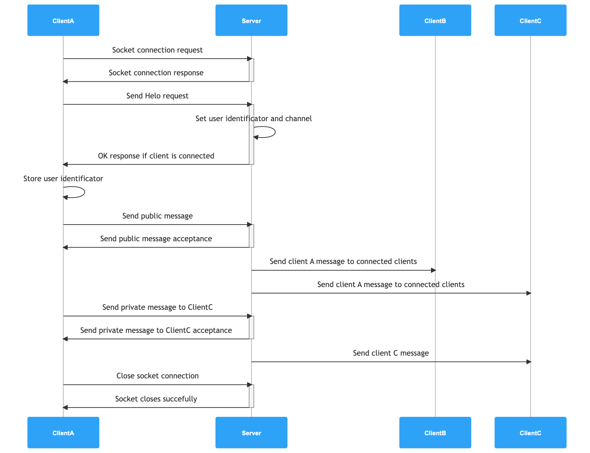

# Tchatche

Multi user interactive system of communication. the application is inspired from chat application which consist of a central server and a set of clients. 

## Application actors

### Server

As a TCP server, this component sets a socket and listen to new client socket connection. the server uses a multi-clients approach, each user connection is handled separately in an execution thread.
Using a specific **Protocol** the server reads and responses according to client request 

### Client

As a TCP client, this component sets a socket and connects to the server, After successfully connecting, the client ping pong with the server by sending request and receiving server response.
Using a specific **Protocol** the client reads and responses according to client request  

## Application layer protocol

The applicative protocol that sits on top of infrastructure (network) protocol ( TCP in this case ), the protocol describes the communication between the client and server achieving the application use cases like sending public message to all connected users, sending a private message, etc..

